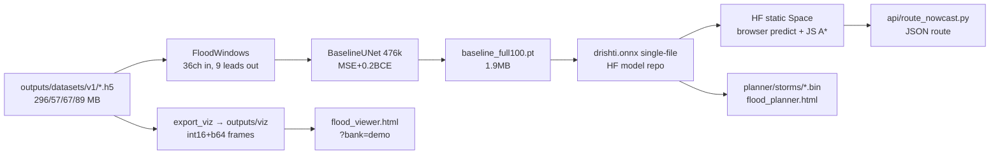

# 02 — Architecture: HOW things connect

## 1. End-to-end pipeline (Track B)

```
Copernicus GLO-30 tile (terrain/raw/N28E077_FABDEM_V1-2.tif 23 MB, archival)
  → kiet_real_terrain_package.zip extraction → data/terrain_grid.json (13×20, 100 valid, 214.68–231.31 m)
  → simulation/terrain/twin.py:95-121 (NaN→nearest via cKDTree, bilinear zoom, +U(-0.075,+0.075) m micro-relief rng 26085)
  → Twin{dem 110×160, masks, manning, imperv, D8 flow_to/accum/low_points p90}
  → simulation/drainage/network.py:15 generate() (score=accum+low bonus+road-prox → greedy 15 m → 2 outfalls → DAG)
  → G(V,E) ~50 inlets, D 0.3–1.2 m, n=0.013, S∈[0.002,0.05]
  → simulation/scenarios/suite_v2.py (quotas + LHS → 360 specs) + simulation/rainfall/generator.py (temporal×spatial → R[nt,110,160])
  → simulation/hydraulics/simulate.py:21 (per-5-min →150×2-s: Horton→depression→DrainageState.step→step_surface)
  → {rain,depth,velocity,flooded≥0.05,node_depth,pipe_flow/capacity,surcharge,overflow,mass}
  → simulation/validation/checks.py (finite, ≤2 m, ≤3 m/s, mass≤0.35, graph)
  → dataset/generator/run_v2.py (parallel, CSV resume, quarantine → outputs/datasets/v1/*.h5 515 MB)
  → dataset/ml_dataset.py:FloodWindows (6-hist→9 leads 5–180 min; 2692/542/606 + 1861 OOD windows)
  → models/baseline_unet.py + train_full.py (MSE+0.2·BCE, Adam 1e-3 → baseline_full100.pt)
  → ONNX single-file (maxdiff 3e-07) → HF static Space (in-browser) + planner/storms/*.bin (baked) + outputs/viz*/ (viewer)
  → api/route.py A* (≥0.05 blocked) → safe routes
```

## 2. Mermaid — physics coupling (one timestep)

```mermaid
flowchart TD
  R[Rainfall generator\ntemporal x spatial\n5-min steps] --> RESCALE[Rescale to spec total\nwet-cell mean\nsimulate.py:39-42]
  RESCALE --> TAIL[Append recession zeros\nrecession_h 0-2h]
  TAIL --> LOOP[Per 5-min step\n150 x 2-s substeps]
  LOOP --> HORTON[Horton infil\ncap=fc+(f0-fc)e^-2.2t\ndepression fill]
  HORTON --> PIPES[DrainageState.step\ninlet min-cap, surcharge x0.3\nQcap*(1-blk), node 1m2x1.5m]
  PIPES --> SURF[step_surface\nManning q=h^5/3/n√S dx\nS≤0.05, 1/8 limiter\nwalls=buildings]
  SURF --> MASS[mass: rain=infil+dep+pond+discharge+stored\n~1e-8]
```

## 3. Mermaid — data → ML → demos



## 4. Mermaid — Track A maps

```mermaid
flowchart TD
  OSM[OSM Overpass\n199 roads + buildings\nway 835252667] --> GJ[data/*.geojson]
  SAN[Sanctioned Rev6 photos\nkiet_campuse_data/16 jpeg] --> AFF[affine A-Z\nbuild_accurate_geojson.py]
  AFF --> GJ
  COP[Copernicus GLO-30\n40MB tif] --> TER[data/terrain_3d.json\n+ overlays]
  GJ --> R2[kiet_road_map.html]
  GJ + TER --> T2[kiet_terrain_map.html]
  GJ + TER --> T3[kiet_3d_standalone.html]
  R2 & T2 & T3 --> IDX[index.html\n6 cards]
```

## 5. Key interfaces (contracts)

| Edge | Contract | File:line |
|---|---|---|
| Twin → network | `twin.dem/accum/low_points/road_dist/in_domain/is_building/X/Y/dx` | `simulation/drainage/network.py:19-22` |
| Spec → simulate | `{seed,total_mm,duration_h,temporal,spatial,sigma,speed,dir,bullseye,variant,drain_eff,blockage,recession_h,...}` | `simulation/hydraulics/simulate.py:24,36-42` |
| Simulate → checks | `{rain,depth,velocity,flooded,node_depth,pipe_flow,surcharge,mass}` | `simulation/validation/checks.py:4-52` |
| H5 → FloodWindows | static 9 ch + dyn 3 ch + leads 9 + graph + spec attrs | `dataset/ml_dataset.py:90-139` |
| Model in/out | `(B,36,110,160) → (B,9,110,160)` | `models/baseline_unet.py:12-37` |
| Depth → route | `ok=valid&(depth<0.05)`; costs 5.0/7.07 m | `api/route.py:5-31` |
| H5 → viewer | int16 mm + b64 frames, `flood≥50 mm`, `flood_m2=cells×25` | `visualization/data_adapter/export_viz.py:94-150` |

## 6. Config fan-in

`config/terrain.yaml` → `twin.py`; `config/drainage.yaml` → `network.py` + `pipes.py` + `simulate.py:54-55`; `config/hydraulics.yaml` → `simulate.py` + `runoff.py` + `checks.py`; `config/rainfall.yaml` → `generator.py` + `spec.py` + `suite_v2.py`; `config/simulation.yaml` → versions/seeds/splits/quarantine. Full key tables in `04_formulas-algorithms-parameters.md` §configs.
